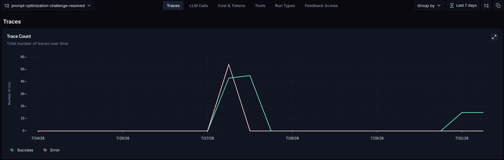
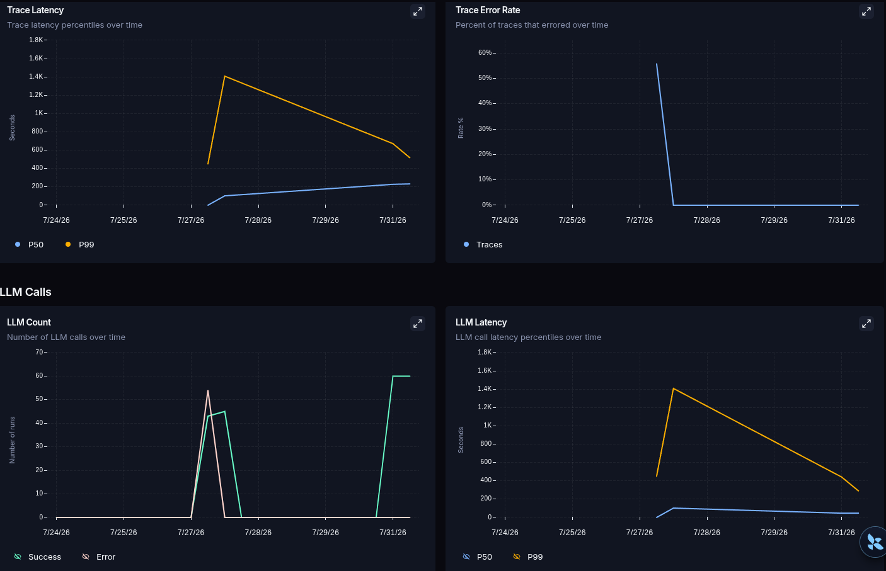
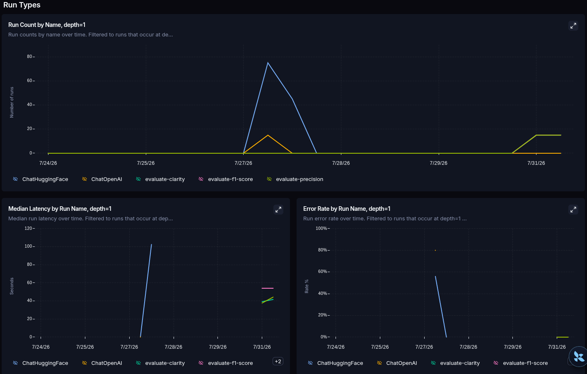
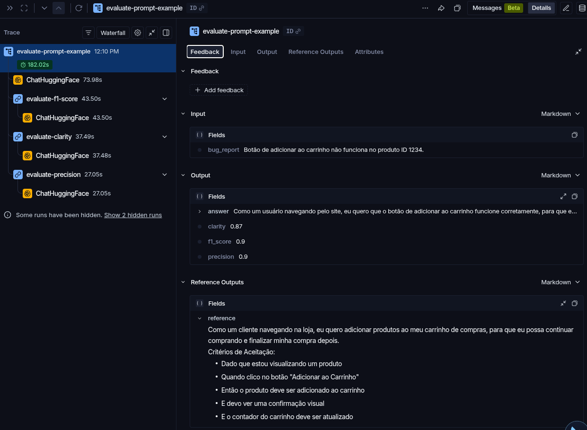
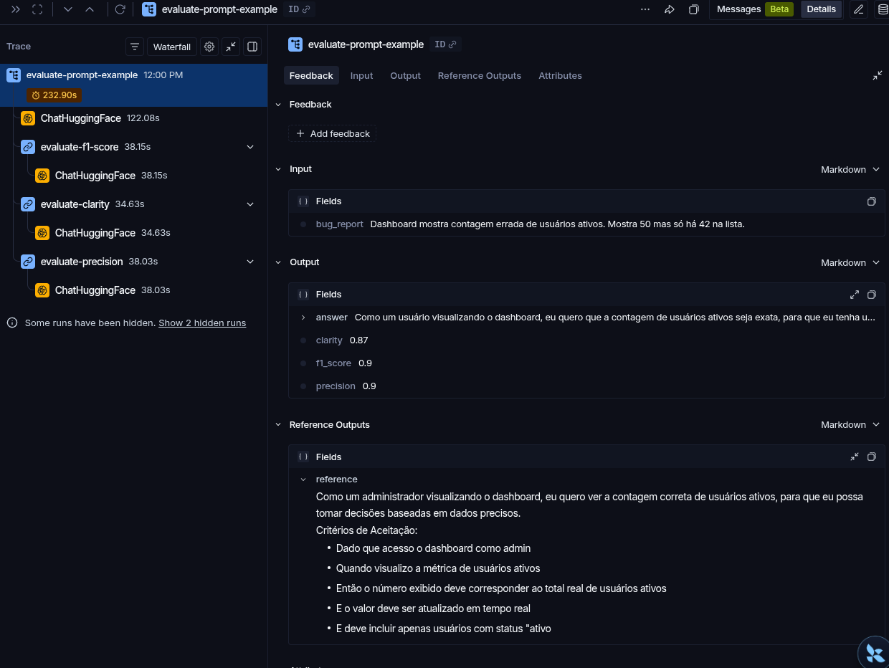
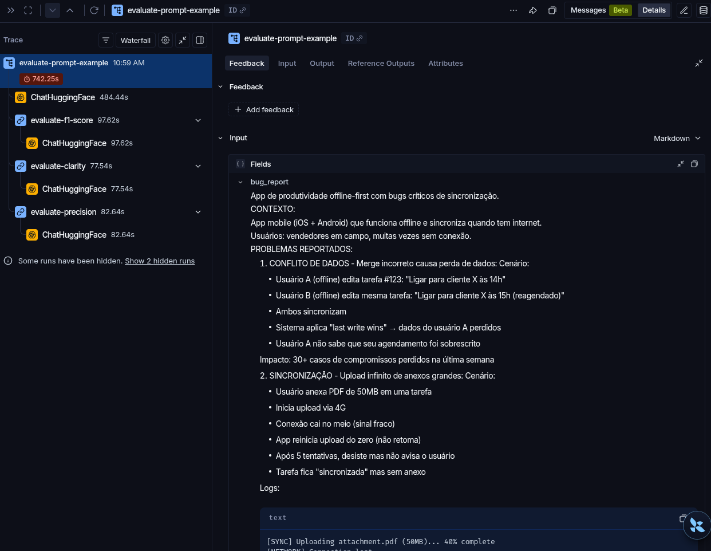

# Pull, Otimização e Avaliação de Prompts com LangChain e LangSmith

## Técnicas Aplicadas (Fase 2)

O prompt `bug_to_user_story_v2` combina três técnicas:

| Técnica | Aplicação | Motivo |
|---|---|---|
| Few-shot Learning | Três pares completos de entrada/saída cobrem bugs de interface, plataforma e filtro de dados | Estabiliza o formato da User Story e dos critérios de aceitação |
| Role Prompting | Define a persona de Product Manager sênior especializado em produtos digitais e requisitos ágeis | Orienta vocabulário, foco no usuário e qualidade dos requisitos |
| Skeleton of Thought | Organiza a análise em usuário, contexto, comportamento, benefício e critérios verificáveis | Evita omissões em relatos complexos sem expor o raciocínio interno |

Também foram adicionadas regras de fidelidade à entrada, formato
Dado/Quando/Então e tratamento explícito para relatos vagos, vazios, sem passos
de reprodução ou com dados sensíveis.

## Resultados Finais

Os prompts v1 e v2 foram avaliados nos 15 exemplos do mesmo dataset com
`Qwen/Qwen2.5-7B-Instruct` como modelo principal e modelo de avaliação. A v1
obteve média geral superior a `0.9`, mas foi reprovada porque o F1-Score ficou
abaixo do limite mínimo. Após a otimização, todas as métricas da v2 atingiram
o mínimo de `0.9`.

| Versão | Helpfulness | Correctness | F1-Score | Clarity | Precision | Média | Status |
|---|---:|---:|---:|---:|---:|---:|---|
| v1 | 0.9123 | 0.9062 | 0.8925 | 0.9047 | 0.9200 | 0.9071 | Reprovado |
| v2 | 0.9063 | 0.9000 | 0.9000 | 0.9127 | 0.9000 | 0.9038 | Aprovado |

Embora a média da v1 seja maior que a da v2, o critério exige que cada uma
das cinco métricas seja maior ou igual a `0.9`. A otimização elevou o
F1-Score de `0.8925` para `0.9000`, atendendo ao requisito que faltava.

**Resultado final da v2:** APROVADO - todas as métricas são maiores ou
iguais a `0.9`.

Evidências:

- Relatório detalhado da v1 com os 15 exemplos:
  [`reports/bug_to_user_story_v1.json`](reports/bug_to_user_story_v1.json)
- Relatório detalhado da v2 com os 15 exemplos:
  [`reports/denis-bug-to-user-story-v2__bug_to_user_story_v2.json`](reports/denis-bug-to-user-story-v2__bug_to_user_story_v2.json)
- Link público do LangSmith: https://smith.langchain.com/hub/denis-bug-to-user-story-v2/bug_to_user_story_v2
- Screenshot das métricas:





- Evidência de pelo menos 3 traces no LangSmith:

| Trace 1                                                         | Trace 2                                     | Trace 3                                     |
|-----------------------------------------------------------------|---------------------------------------------|---------------------------------------------|
|  |  |  |


## Como Executar

### Pré-requisitos

- Python 3.14 ou superior
- `uv` para instalar as dependências bloqueadas em `uv.lock`
- Conta e API key do LangSmith
- API key da OpenAI ou do Google Gemini

### Configuração

```bash
cp .env.example .env
uv sync --all-groups
```

Preencha no `.env`:

- `LANGSMITH_API_KEY`
- `LANGSMITH_PROJECT`
- `USERNAME_LANGSMITH_HUB`
- `LLM_PROVIDER` e a chave correspondente (`OPENAI_API_KEY` ou
  `GOOGLE_API_KEY`)

### Tracing com LangSmith

O tracing da avaliação é opcional e controlado pelo `config.py`. Configure:

```env
LANGSMITH_TRACING=true
LANGSMITH_ENDPOINT=https://api.smith.langchain.com
LANGSMITH_API_KEY=lsv2_...
LANGSMITH_PROJECT=prompt-optimization-challenge-resolved
```

Ao executar `make evaluate`, cada exemplo cria um trace pai chamado
`evaluate-prompt-example`, associado ao exemplo do dataset. A árvore do trace
inclui:

1. Geração da User Story pelo modelo principal.
2. Avaliação de F1-Score pelo LLM-as-Judge.
3. Avaliação de Clarity.
4. Avaliação de Precision.

Os traces recebem as tags `bug-to-user-story`, `evaluation` e `example-N`,
além de metadata com provider, modelos, prompt e índice do exemplo. Para
consultá-los, abra **LangSmith > Projects** e selecione o projeto definido em
`LANGSMITH_PROJECT`.

Definir somente `LANGSMITH_API_KEY` não habilita observabilidade: essa chave
também é usada para prompts e datasets. Para enviar traces,
`LANGSMITH_TRACING` deve estar como `true`. Use `false` quando os relatos
contiverem dados que não devem ser enviados ao LangSmith.

Para usar Hugging Face Inference Providers:

```env
LLM_PROVIDER=hugging_face
HUGGING_FACE_API_KEY=hf_seu_token
LLM_MODEL=Qwen/Qwen2.5-7B-Instruct
EVAL_MODEL=Qwen/Qwen2.5-7B-Instruct
HF_EXECUTION_MODE=inference
HF_INFERENCE_PROVIDER=together
HF_MAX_NEW_TOKENS=1024
```

O token precisa ter permissão para Inference Providers. O modelo configurado
também deve estar disponível em algum Inference Provider; a existência do
modelo no Hub, isoladamente, não garante que ele possa ser executado pela API.
Use o playground do Hugging Face para confirmar a disponibilidade antes da
avaliação.

Essa integração usa exclusivamente as classes nativas `HuggingFaceEndpoint` e
`ChatHuggingFace` do pacote `langchain-huggingface`. Habilite o provider
`together` nas configurações de Inference Providers antes da execução. Essa
opção pode consumir os créditos da conta. Não combine um modelo com um provider
que não aparece para ele na lista de Inference Providers.

As chamadas hospedadas consomem os créditos de Inference Providers. Uma
avaliação com 15 exemplos faz até 60 chamadas: 15 gerações e 45 avaliações
LLM-as-Judge. Se a API retornar `402 Payment Required`, adicione créditos,
aguarde a renovação da franquia ou use execução local:

```bash
uv sync --extra hugging-face-local
```

```env
LLM_PROVIDER=hugging_face
LLM_MODEL=Qwen/Qwen2.5-0.5B-Instruct
EVAL_MODEL=Qwen/Qwen2.5-0.5B-Instruct
HF_EXECUTION_MODE=local
HF_MAX_NEW_TOKENS=1024
```

O modo local usa `HuggingFacePipeline`, não acessa o Inference Router e não
exige `HUGGING_FACE_API_KEY`. O modelo é baixado na primeira execução; confira
antes o espaço em disco e a memória disponíveis.

### Selecionar prompts para avaliação

O `evaluate.py` descobre automaticamente as chaves declaradas nos arquivos
`prompts/*.yml`. Para listar as opções sem carregar o modelo:

```bash
uv run python -m src.evaluate --list-prompts
```

Sem argumentos, a versão `bug_to_user_story_v2` é usada. Para avaliar somente
a v1:

```bash
uv run python -m src.evaluate --prompt bug_to_user_story_v1
```

Repita `--prompt` para comparar versões na mesma execução, usando o mesmo
dataset, modelo e métricas:

```bash
uv run python -m src.evaluate \
  --prompt bug_to_user_story_v1 \
  --prompt bug_to_user_story_v2
```

Os mesmos argumentos podem ser enviados pelo Makefile:

```bash
make evaluate EVALUATE_ARGS="--prompt bug_to_user_story_v1"

make evaluate EVALUATE_ARGS="--prompt bug_to_user_story_v1 --prompt bug_to_user_story_v2"
```

Os YAMLs são carregados diretamente do diretório local; não é necessário
publicá-los no Prompt Hub antes da avaliação. Cada prompt gera seu próprio
arquivo JSON em `reports/`. É esperado que a comparação retorne exit code `1`
quando uma das versões não atingir o threshold de `0.9`.

### Fluxo completo

```bash
# 1. Baixar o prompt inicial público
uv run python -m src.pull_prompts

# 2. Validar a versão otimizada local
uv run pytest tests/test_prompts.py -v

# 3. Publicar a v2 como prompt público
uv run python -m src.push_prompts

# 4. Criar/reutilizar o dataset e avaliar os 15 exemplos
uv run python -m src.evaluate
```

O script de avaliação retorna código `0` somente quando todas as cinco métricas
e a média geral são maiores ou iguais a `0.9`.
